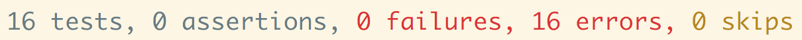
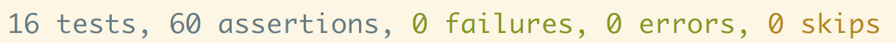

# Adagrams

## At a Glance
- Pair, [stage 2](https://github.com/Ada-Developers-Academy/pedagogy/blob/master/rule-of-three.md#stage-2) project
- Due before class, **DATE HERE**

## Introduction

An [anagram](https://en.wikipedia.org/wiki/Anagram) is a word or phrase formed by rearranging the letters of a different word or phrase. _Adagrams_ is a fictional game in which a player is given a random set of letters and must make an anagram using those letters. _Adagrams_ has a specific scoring system, so that the player's submitted anagram scores points. The rules for Adagrams are roughly inspired by the "Letter Round" portion of the British game show [Countdown](https://en.wikipedia.org/wiki/Countdown_%28game_show%29%23Letters_round).

While working on _Adagrams_, it may help to think of a physical metaphor for this game, such as other common word games like _Scrabble_ or _Bananagrams_. These analog games all feature a _pool_ of letter _tiles_ that the player _draws_ from.

In this version of _Adagrams_, we will only be working with the English alphabet.

## Learning Goals

- Write Ruby code with methods that declare data, read data, and manipulate data
- Write Ruby code with methods that take in parameters, use parameters, and return manipulated data
- Use pair-programming techniques
- Instill the habit of running unit tests to verify that the program works as expected

## Objective

We will make a Ruby implementation of _Adagrams_ that runs [in the command line](https://en.wikipedia.org/wiki/Command-line_interface).

The program should also pass the provided unit tests.

## Getting Started

* From the project root, you are able to execute all of your specs by running `rake` in Terminal

For the curious about `rake`, click here

`rake` [(official site)](https://github.com/ruby/rake) is a program that runs tasks that we define. In this case, we have a pre-defined task that executes the tests. By running `rake`, we are saying something like, "Please run the tasks, which includes the task that executes the tests."

### Tests
We have provided unit tests for you to run. A complete project will pass all 16 provided tests.

To run the tests, in the command line, navigate to the project root and then run the command `$ rake` (without the `$`. Remember, `$` indicates that it is a command line command.)

When you first open the project and run the tests with `rake`, you should have 0 passing tests and 16 failures. You should see something similar to the following screenshots:

What do these errors mean? These errors should help guide you with the next step to completing the project.

The tests for this project are written in [minitest](https://github.com/seattlerb/minitest), a testing framework by Seattle Ruby Brigade.

Do not move onto a new wave of requirements until the minimum requirements of the previous wave are complete and your specs are green across the board.

Here is what it looks like when all 16 tests are passing:

### Pair Programming
Utilize good pair programming practices. Refer to articles from the [Agile Alliance](http://guide.agilealliance.org/guide/pairing.html), the [Agile Institute](http://powersoftwo.agileinstitute.com/2015/02/benefits-of-pair-programming-revisited.html), and [our own suggestions for pairing](https://github.com/Ada-Developers-Academy/textbook-curriculum/blob/master/00-programming-fundamentals/programming-techniques-pairs-or-solo.md#pair-programming) if you need a refresher for some best practices. Switch _driver_ and _navigator_ roles often. When there is uncertainty or confusion, step away from the keyboard and discuss, plan, and document on paper or whiteboard before continuing.

### Driver Code
We have provided some driver code for your Adagrams game in the files `wave-1-game.rb`, `wave-2-game.rb`, `wave-3-game.rb`, and `wave-4-game.rb`. Running `$ ruby wave-1-game.rb` will begin a command-line game that uses your Adagrams code. The boilerplate code will break the first time you run it: working through the waves specified below should create a running version of the game. **Implementing code to make this game run is not a substitute for making the tests pass**. It is simply there for you and your pair to reference how the Game may run during each wave, to have better perspective of what your program can do, and to get some practice reading other peoples' code. We fully expect you to create the specified methods to specification and making the tests pass.

## Setup Requirements
### Setup For Collaboration
1. You'll be working with an assigned pair. High-five your pair.
1. Choose **one person** to fork the project repo.
1. Add the other person in the pair (who didn't fork) to the forked repo as a _collaborator_. Instructions [here](https://help.github.com/articles/inviting-collaborators-to-a-personal-repository/).
1. Pick one machine to work on for the first few days.
1. That machine will clone the forked repo: `$ git clone [YOUR FORKED REPO URL]`
1. `cd` into the dir created.

**Note:** At this point, we have to work off of one machine, and if we need to share code with each other, we need to do something awkward, unreliable, and slow, like email files of code to each other. Later this week, we'll learn how to get the code onto both machines and collaborate simultaneously using Git.

### Setup a Pair Plan

First, come up with a "plan of action" for how you want to work as a pair. Discuss your learning style, how you prefer to receive feedback, and one team communication skill you want to improve with this experience.

### Get Familiar

Take time to read through the Wave 1 implementation requirements and the tests for wave 1. Write down your questions, and spend some time going through your understanding of the requirements and tests with your pair. Make sure you both can run `$ rake` and see the tests fail.

Come up with a "plan of action" for your implementation with your pair.

## Implementation Requirements

### Wave 1

Implement the following method in the file `adagrams.rb`:
- `draw_letters`
  - In Adagrams, we need to get a random set of 10 letters, particularly from a "tile bag" or "letter pool." This method should get those random letters
  - Has no parameters
  - Returns an array of ten strings
  - Each string in this array should be a string that is one letter long
  - The letters should be pulled from a pool of letters. This letter pool should take into account the distribution of letters as described in the table below. For example, the table below describes that there are only 9 available 'A' letters. Therefore, `draw_letters` cannot ever return more than 9 'A' letters
  - The letters drawn should be pulled from a pool of letters randomly

#### Distribution of Letters

| Letter : Qty. | Letter : Qty. |
|:------:|:-----:|
| A : 9  | N : 6 |
| B : 2  | O : 8 |
| C : 2  | P : 2 |
| D : 4  | Q : 1 |
| E : 12 | R : 6 |
| F : 2  | S : 4 |
| G : 3  | T : 6 |
| H : 2  | U : 4 |
| I : 9  | V : 2 |
| J : 1  | W : 2 |
| K : 1  | X : 1 |
| L : 4  | Y : 2 |
| M : 2  | Z : 1 |

There is no requirement for the program to change this letter pool over time. Imagine that every time this method is called, it is a new letter pool every time.

### Wave 2

Implement the following method in the file `adagrams.rb`:

- `uses_available_letters? input, letter_bank`
  - This method should check if the input word only uses characters that are contained within the passed in letter bank. Essentially, this method checks if the word is, indeed, an anagram of some or all of the given letters
  - Has two parameters:
     - `input`, the first parameter, describes some input word, and is a string
     - `letter_bank`, the second parameter, describes an array of drawn letters. You can expect this to be an array of ten strings, with each string representing a letter
  - Returns either `true` or `false`
  - Returns `true` if every letter in the `input` word is available (in the right quantities) in the `letter_bank`
  - Returns `false` if not; if there is a letter in `input` that is not present in the `letter_bank` or has too much of compared to the `letter_bank`

### Wave 3

Implement the following method:

- `score_word word`
  - This method returns the score of a given word as defined by the Adagrams game
  - Has one parameter: `word`, which is a string of characters
  - Returns an integer representing the number of points
  - Each letter within `word` has a point value. The number of points of each letter is summed up to represent the total score of `word`
  - Each letter's point value is described in the table below
  - If the length of the word is 7, 8, 9, or 10, then the word gets an additional 8 points

#### Score chart

|Letter                        | Value|
|:----------------------------:|:----:|
|A, E, I, O, U, L, N, R, S, T  |   1  |
|D, G                          |   2  |
|B, C, M, P                    |   3  |
|F, H, V, W, Y                 |   4  |
|K                             |   5  |
|J, X                          |   8  |
|Q, Z                          |   10 |

### Wave 4

Implement the following method:

- `highest_score_from words`
  - This method looks at the array of `words` and calculates which of these words has the highest score, applies any tie-breaking logic, and returns the winning word in a special data structure
  - Has one parameter: `words`, which is an array of strings
  - Returns a single hash that represents the data of a winning word and its score. The hash should have the following keys:
    - `:word`, whose value is a string of a word
    - `:score`, whose value is the score of that word
  - In the case of tie in scores, use these tie-breaking rules:
      - prefer the word with the fewest letters...
      - ...unless one word has 10 letters. If the top score is tied between multiple words and one is 10 letters long, choose the one with 10 letters over the one with fewer tiles
      - If the there are multiple words that are the same score and the same length, pick the first one in the supplied list

## What Instructors Are Looking For
Check out the [feedback template](feedback.md) which lists the items instructors will be looking for as they evaluate your project.
